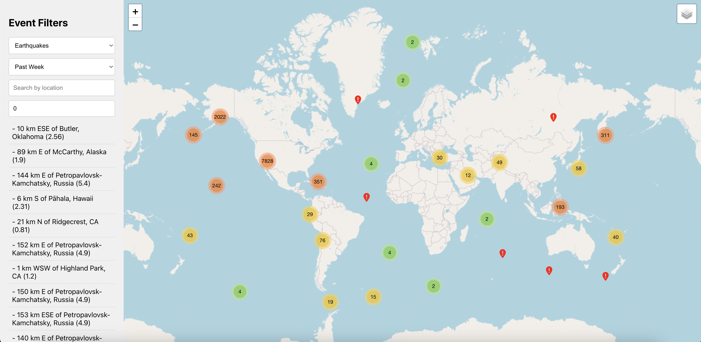

# Real_Time_Event_Viewer 🌎

## Project Description

**Real_Time_Event_Viewer** is a real-time data visualization tool designed to showcase the interconnectedness of natural and human events around the world. Its purpose is to create a visual narrative about the dynamics and constant change of our planet, allowing users to explore and better understand the events that surround us.

## Purpose

This application serves to:

- **Visualize Events in Real-Time:** Displays geolocated events such as earthquakes and volcanoes on an interactive map.
- **Filter and Customize Visualization:** Allows users to activate or deactivate data layers to personalize their viewing experience.
- **Explore the Interconnection of Events:** Facilitates understanding of how different events are related and how they impact our planet.
- **Provide Detailed Information:** Offers detailed information about each event by selecting a marker on the map.

## Use Case: Event Filtering

The primary use case focuses on **event exploration through filters**. Users can activate or deactivate data layers (earthquakes, volcanoes, etc.) to customize their viewing experience. This is achieved through an interactive sidebar that controls what information is overlaid on the main map.



## Technology Stack

The application is built using the following technologies:

- **Front-end:**
  - **React:** For building the user interface, providing an interactive and component-based experience.
- **State Management:**
  - **Redux Toolkit:** For managing the global state of the application, such as active filters, map style, and selected event. Redux Toolkit simplifies the configuration and use of Redux, providing tools to create reducers, actions, and selectors more efficiently.
- **Map Visualization:**
  - **Leaflet.js:** For interactive map visualization. Leaflet is a lightweight and flexible JavaScript library for creating mobile-friendly web maps.
- **Styling:**
  - **CSS Modules:** For managing CSS styles in a modular and encapsulated way, avoiding conflicts between styles from different components.
- **HTTP Requests:**
  - **Axios:** Promise-based HTTP client for making requests to the server.
- **Code Formatting:**
  - **Prettier:** To maintain a consistent code style throughout the project.

## APIs Used

The application uses the following APIs to obtain real-time data:

- **USGS Earthquake API:** To obtain real-time earthquake data.
  - Base URL: `https://earthquake.usgs.gov/earthquakes/feed/v1.0/summary/`
  - Endpoint: `${timePeriod}.geojson` (where `timePeriod` can be `all_hour`, `all_day`, `all_week`, `all_month`)
  - Usage: Used to obtain earthquake data based on the time period selected by the user.
- **USGS Volcanoes API:** To obtain data on volcanoes and volcanic activity.
  - URL: `https://earthquake.usgs.gov/earthquakes/feed/v1.0/summary/significant_month.geojson`
  - Usage: Used to obtain data on volcanoes and volcanic activity, filtering out events that are not earthquakes.

## Project Structure

## Setup and Installation

Follow these steps to set up and run the project in your local environment:

### Prerequisites

- **Node.js:** Make sure you have Node.js installed on your system. You can download it from [https://nodejs.org/](https://nodejs.org/).
- **npm:** Node Package Manager (npm) is automatically installed with Node.js.

### Installation Steps

1.  **Clone the Repository:**

```bash
git clone https://github.com/rost929/Real_Time_Event_Viewer.git
cd Real_Time_Event_Viewer
```

2.  **Install Dependencies:**

```bash
npm install
```

3. **Start Development Server**

```bash
npm start
```
